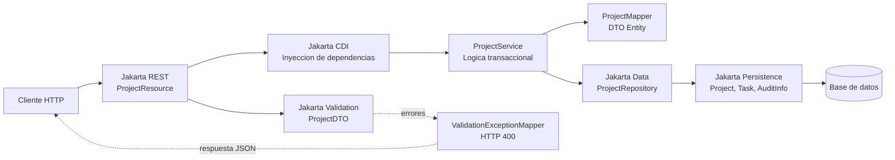

# Expo 01: El camino del dato

Esta carpeta contiene la versión de `ProjectTracker` usada para el primer acto de la charla: **cómo modelo, valido, expongo y persisto información con Jakarta EE 11**.

No está pensada como tutorial paso a paso. Es una foto funcional del proyecto para mostrar cómo varias especificaciones de Jakarta EE trabajan juntas en una aplicación empresarial pequeña, pero realista.

## Qué cubre

- **Jakarta REST** expone la API HTTP de proyectos.
- **JSON-B** serializa y deserializa los DTOs usados por la API.
- **Jakarta CDI** conecta recursos, servicios, mappers y repositorios.
- **Jakarta Persistence** modela entidades, relaciones y datos embebidos.
- **Jakarta Validation** expresa reglas del contrato de entrada.
- **Jakarta Data** reduce código de acceso a datos con repositorios declarativos.
- **Jakarta Transactions** delimita las operaciones de negocio desde el servicio.

La idea central de este acto es que el endpoint REST no sea el lugar donde vive toda la lógica. El recurso HTTP recibe la petición, valida el contrato, delega en un servicio CDI y termina persistiendo con un repositorio Jakarta Data.

## Componentes principales

- `ProjectResource`: frontera HTTP para consultar y crear proyectos.
- `ProjectDTO`: contrato JSON validado con Jakarta Validation.
- `ProjectService`: caso de uso transaccional de la aplicación.
- `ProjectRepository`: repositorio Jakarta Data con consultas derivadas.
- `Project`, `Task`, `AuditInfo`: modelo persistente con Jakarta Persistence.
- `ProjectMapper`: conversión entre entidad y DTO.
- `ValidationExceptionMapper`: respuesta clara para errores de validación.

## Diagrama

## Demo sugerida

1. Mostrar `GET /resources/projects`.
2. Crear un proyecto con `POST /resources/projects`.
3. Forzar un error de validación para mostrar el contrato.
4. Abrir `ProjectRepository` y explicar `findByStatus`.
5. Abrir `ProjectService` y mostrar cómo CDI, transacciones y Jakarta Data reducen ruido.

## Mensaje para la charla

En este punto ya hay REST, JSON, validación, CDI, transacciones y persistencia trabajando bajo contratos estándar. La aplicación todavía no salió del ecosistema Jakarta EE, y aun así ya tiene una arquitectura separada por responsabilidades.
